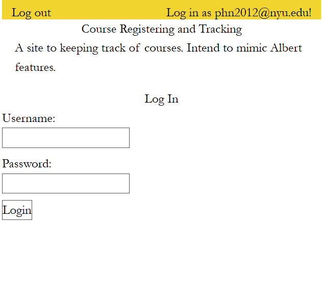

Milestone 03
===

Repository Link
---
https://github.com/nyu-csci-ua-0467-001-002-fall-2024/final-project-PhucNguyen-rsc 

URL for deployed site 
---
http://linserv1.cims.nyu.edu:12198 (server)
http://linserv1.cims.nyu.edu:33929 (react) --> run this

URL for form 1 (login) 
---

Special Instructions for Form 1
---
This is the login form. I transfer the whole code to React compared to last time

URL for form 2 (for current milestone - registration form)
---

Special Instructions for Form 2
---
This is the login form. I transfer the whole code to React compared to last time

URL(s) to github repository with commits that show progress on research
--- 
Check client/ --> you will see that I transfer all the visualizations and form to front end. Planning to adapt Tailwind later (since it's not that significant for the functioning of the page at the moment)

Reference
---
Authentication code is based on HW_06