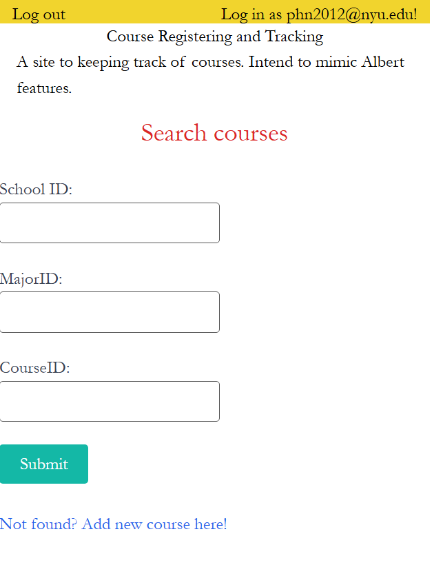
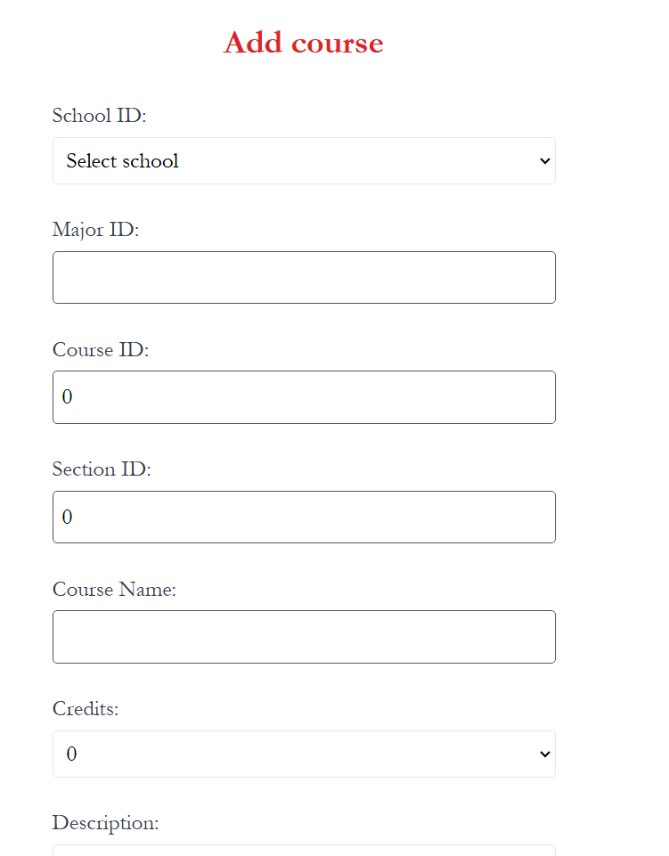

# CoursePlanning!

## Overview

Course registration timeslot is coming right up! CoursePlanning allows you to  display all of your courses in shopping carts in Google Calendar block style. This will help you manage and select the courses that will fit into your timetable the best! (Albert already has this feature, check Weekly Schedule option in Albert main page. My Goal is to re-implement something similar to that). The users will log into their accounts, then select courses from the course searching option. If the course is not in the dataset yet, the user can add a new course via a submitted form. The user also has an option to modify the course information after added. After adding all the courses, the user can have it displayed in Google Calendar block style.


## Data Model

The application will store Users, CourseList

* users can have multiple courses in the course list.
* each course in the course list will be manually into the database if not existed before. Entering Search Course option 

An Example User:

```javascript
{
  username: "phucfindingcourses",
  hash: // a password hash,
  courses: // an array of references to List of courses in CourseList
}
```

An Example List with Embedded Items:

```javascript
{
  user: // a reference to a User object
  hash: //,
  courses: [Course1, Course2,...], //id
}
```

An Example Course in CourseList:

```javascript
{ //Example: Intro to Foods and Food Science NUTR-UE 85 001 
  schoolID: 08 //example Steinhardt --> this will likely be represented as number. Let's say Steinhardt is 08.
  majorID: "NUTR-UE", //department-code
  courseID: 85,
  sectionID: 1,
  name: "Intro to Foods and Food Science",
  credits: 4,
  instructor: "", //optional
  description: "", //optional
  instruction_mode:'in-person',
  time: [{time_date: 'monday', time_start: 10, time_end: 12}, {time_date: 'wednesday', time_start: 10, time_end: 12}], //to display courses
  slug:"08-NUTR-UE-85-1", //school - department code - courseID - sectionID
}
```

## [Link to Commented First Draft Schema](src/db.mjs) 

## Wireframes

/


/courses


/courses/details (view a course in details - Albert Style)


/courses/edit


/courses/search


/courses/search (If found)


/courses/search (If not)


/course/add


/course/display


## Site map


## User Stories or Use Cases

1. as non-registered user, I can register a new account with the site
2. as a user, I can log in to the site and view courses
3. as a user, I can see the details of each course when i click to each one
4. as a user, I can edit the course schedule 
5. as a user, I can add new courses to the database if it has not existed before
6. as a user, I can display all my courses in the weekly schedule timetable

## Research Topics

* (5 points) REACT
* (5 points) tailwind.css / Bootstrap

These are complicated libraries --> that's why I allocate more points to it.


## [Link to Initial Main Project File](app.mjs) 

## Annotations / References Used

1. [tutorial on react](https://legacy.reactjs.org/tutorial/tutorial.html)
2. [tutorial on tailwind](https://tailwindcss.com/docs)
3. [tutorial on bootstrap](https://getbootstrap.com/docs/5.2/getting-started/introduction/) 

